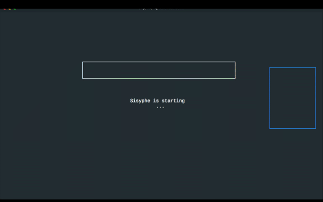
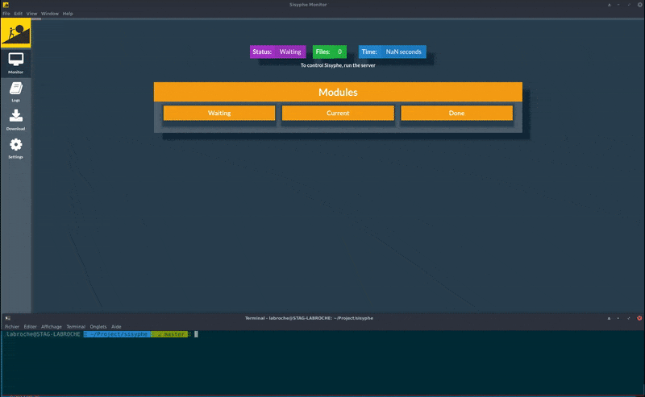

[](https://travis-ci.org/istex/sisyphe)
[](https://www.bithound.io/github/istex/sisyphe)


## Sisyphe

Sisyphe is a generic NodeJS recursive folder analyser terminal application & a ([lerna](https://github.com/lerna/lerna)) git [monorepo](https://github.com/babel/babel/blob/master/doc/design/monorepo.md).



### Requirements
Tested with NodeJS@8.X, Redis@3.2.6

Works on Linux/OSX/Windows

Example to run a quick local redis (thanks to docker):
```bash
docker run --name sisyphe-redis -p 6379:6379 redis:3.2.6
```

### Install it

1. Download the latest Sisyphe version 
2. Just do : `npm install` (this will execute a npm postinstall)
3. ... that's it.

### Test

`npm run test` will test sisyphe & its workers

### Help

`./app.js --help` Will output help

### Options
    -V, --version               output the version number
    -n, --corpusname <name>     Corpus name
    -s, --select <name>         Select all module to deal with
    -c, --config-dir <path>     Configuration folder path
    -t, --thread <number>       The number of process which sisyphe will take
    -b, --bundle <number>       Regroup jobs in bundle of jobs
    -r, --remove-module <name>  Remove module name from the workflow
    -q, --quiet                 Silence output
    -l, --list                  List all available workers
    -h, --help                  output usage information

### How it works ?

Just start Sisyphe on a folder with any files in it.

`node app -n corpusname ~/Documents/customfolder/corpus`


`node app -n corpusname -c ~/Documents/customfolder/corpusResources ~/Documents/customfolder/corpus`


Sisyphe is now working in background with all your computer thread.
Just take a coffee and wait , it will prevent you when it's done :)

The results of sisyphe are present @ `sisyphe/out/{timestamp}-corpusname/` (errors,info,duration..)

For a control panel & full binded app, go to [Sisyphe-monitor](https://github.com/istex/sisyphe-monitor)
sisyphe has a server that allows to control it and to obtain more information on its execution.
Simply run the server with `npm run server` to access these features




### Modules
There is a list of default modules (focused on xml & pdf).

Those URL NEED to be updated when merge branch will be ok.
- [FILETYPE](https://github.com/istex/sisyphe/tree/master/src/worker/filetype) Will detect mimetype,extension, corrupted files..
- [PDF](https://github.com/istex/sisyphe/tree/master/src/worker/pdf) Will get info from PDF (version, author, meta...)
- [XML](https://github.com/istex/sisyphe/tree/master/src/worker/xml) Will check if it's wellformed, valid-dtd's, get elements from balises ...
- [XPATH](https://github.com/istex/sisyphe/tree/master/src/worker/xpath)  Will generate a complete list of xpaths from submitted folder
- [OUT](https://github.com/istex/sisyphe/tree/master/src/worker/out) Will export data to json file & ElasticSearch database
- [NB](https://github.com/istex/sisyphe/tree/master/src/worker/nb) Try to assing some categories to an XML document by using its abstract
- [MULTICAT](https://github.com/istex/sisyphe/tree/master/src/worker/multicat) Try to assing some categories to an XML document by using its identifiers
- [TEEFT](https://github.com/istex/sisyphe/tree/master/src/worker/teeft) Try to extract keywords of a fulltext
- [SKEEFT](https://github.com/istex/sisyphe/tree/master/src/worker/skeeft) Try to extract keywords of a structured fulltext by using teeft algorithm and text structuration


### Developpement on worker

When you work on worker, just:
- Commit your changes as easy
- Do a `npm run updated` (to check what worker has changed)
- Do a `npm run publish` (it will ask you to change version of module worker & publish it to github)


### Modules informations
 
Some bugs could occured with certains files with 'skeeft' on windows module please just disactivate it until we fix.
